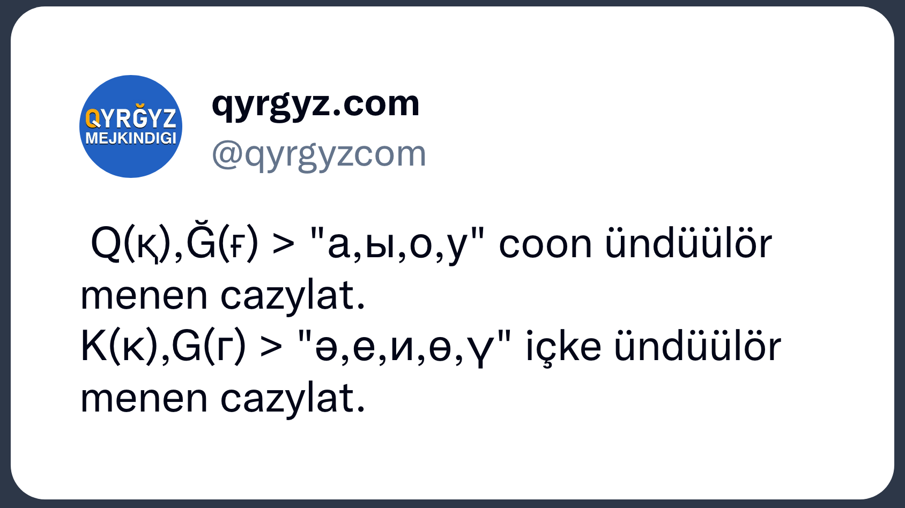

[](https://github.com/kyrgyz-nlp/qtr/actions/workflows/go.yml)

# 🐭 Qytyr qytyr

Kiril tamğasynan Qyrğyz-latyn tamğasyna transliterlöö.

## 🤌 Qoldonuu

### 🛠️ Quruu

```sh
go build .
```

### 🔮 Tekstterdi transliterlöö

```sh
cat FILE.txt | ./qtr
echo "Салам дүйнө" | ./qtr
```

## 📑 Transliterlöö negizi

Qoşumça ә, қ, ғ tamğalary qoşulğan,
sebebi Qazak, Azerbajcan tilderinde qoldonulat.

| ⬇️ Kiçi tamğalar | ⬆️ Çoñ tamğalar |
|------------------|-----------------|
| `а => a`         | `А => A`        |
| `б => b`         | `Б => B`        |
| `в => v`         | `В => V`        |
| `г => g`         | `Г => G`        |
| `ғ => ğ`         | `Ғ => Ğ`        |
| `д => d`         | `Д => D`        |
| `е => e`         | `Е => E`        |
| `ё => jo`        | `Ё => JO`       |
| `ж => c`         | `Ж => C`        |
| `з => z`         | `З => Z`        |
| `и => i`         | `И => I`        |
| `й => j`         | `Й => J`        |
| `к => k`         | `К => K`        |
| `қ => q`         | `Қ => Q`        |
| `л => l`         | `Л => L`        |
| `м => m`         | `М => M`        |
| `н => h`         | `Н => H`        |
| `ң => ñ`         | `Ң => Ñ`        |
| `о => o`         | `О => O`        |
| `ө => ö`         | `Ө => Ö`        |
| `п => p`         | `П => P`        |
| `р => r`         | `Р => R`        |
| `с => s`         | `С => S`        |
| `т => t`         | `Т => T`        |
| `у => u`         | `У => U`        |
| `ү => ü`         | `Ү => Ü`        |
| `ф => f`         | `Ф => F`        |
| `х => h`         | `Х => H`        |
| `ц => ''`        | `Ц => ''`       |
| `ч => ç`         | `Ч => Ç`        |
| `ш => ş`         | `Ш => Ş`        |
| `щ => ş`         | `Щ => Ş`        |
| `ь => ''`        | `Ь => ''`       |
| `ъ => ''`        | `Ъ => ''`       |
| `ы => y`         | `Ы => Y`        |
| `э => ä`         | `Э => Ä`        |
| `ә => ә`         | `Ә => Ә`        |
| `ю => ju`        | `Ю => JU`       |
| `я => ja`        | `Я => JA`       |

## 🇰🇬 Qyrğyz.com



<hr>
<p align="center">✨ 🚀 ✨</p>
